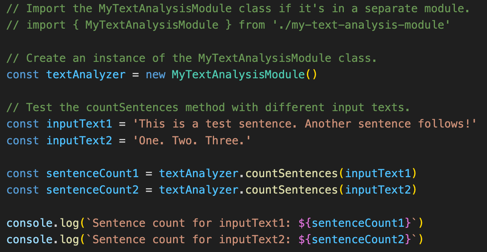

# The text analasys application

This is a student project in the course Mjukvarukvalitet 1dv610 at Linneuniversitetet.

## Description
This application will be able to count the number of words you entered, the number of sentences and the number of characters. It will also let you know which word is the longest in your text input.

## Installation
1. Clone the git repository and place it somewhere on your computer.
2. Open a terminal.
3. Place yourself in the root folder of the application.
4. Open a terminal in the application folder and input ```npm install``` to install all the dependencies the application needs.

```bash
npm install
```

## How to run the application
1. Place yourself in the root folder of the application.
2. Start the application in the terminal with ```npm run dev```.
3. Open a browser you prefere and paste in the URL that is similar to this 'http://localhost:5173/'.

```bash
npm run dev
```

## How to use/test the methods

Here is an example on how to use and test the methods, in this example the countSentences method is used.

