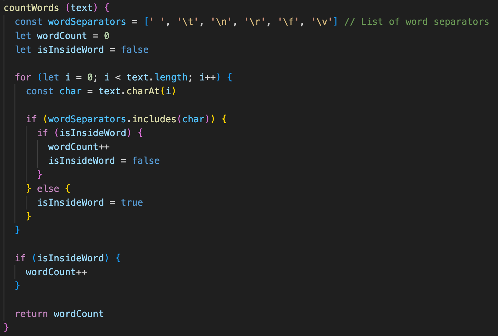
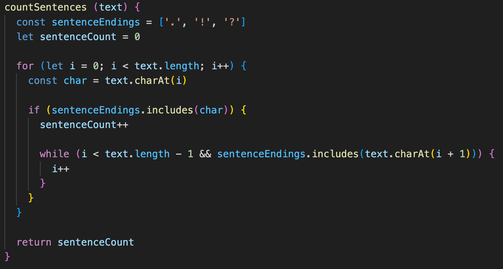

# Testrapport - Manuella tester

| Test | Beskrivning               | Utfall PASS/FAIL |
|------|---------------------------|------------------|
| UC1 | Starta applikationen och se om man kommer till startsidan. |  Pass  |
| UC2 | Testar att skriva in en text och se om den analyserar texten som skrivs/skrivits.|  Pass  |
| UC3 | Testar att skriva in en kodsnutt.|  Pass  |
| UC4 | Testar att kopiera in massa text. |  Pass  |

<br>

### UC1
<b>Beskrivning:</b> Starta applikationen och se om man kommer till startsidan.

<b>Testinstruktioner:</b>
1. Öppna upp terminalen i visual studio code.
2. Skriv in `npm run dev`
3. Öppna URL:en som finns liknande detta exempel: `Local:   http://localhost:5173/` i en webbläsare.

<b>Förväntad resultat:</b>
Nu borde startsidan av applikationen visas.

<hr>

### UC2
<b>Beskrivning:</b> Testar att skriva in en text och se om den analyserar texten som skrivs/skrivits.

<b>Testinstruktioner:</b>
1. Öppna upp terminalen i visual studio code.
2. Skriv in `npm run dev`
3. Öppna URL:en som finns liknande detta exempel: `Local:   http://localhost:5173/` i en webbläsare.
4. Klicka i textfältet och börja skriva.


<b>Förväntad resultat:</b>
Texten ska börja analyseras i realtid och du ska kunna se antalet ord, tecken, meningar och vilket det längsta ordet i din text är.

<hr>

### UC3
<b>Beskrivning:</b> Testar att skriva in en kodsnutt.

<b>Testinstruktioner:</b>
1. Öppna upp terminalen i visual studio code.
2. Skriv in `npm run dev`
3. Öppna URL:en som finns liknande detta exempel: `Local:   http://localhost:5173/` i en webbläsare.
4. Klicka i textfältet och skriv in följande kodsnutt: ```<style> .colored-text {
            color: blue;
        }</style>```


<b>Förväntad resultat:</b>
Du bör direkt få ett meddelande som säger att det inte är tillåtet att använda dessa tecken < >.

<hr>

### UC4
<b>Beskrivning:</b> Testar att kopiera in massa text.

<b>Testinstruktioner:</b>
1. Öppna upp terminalen i visual studio code.
2. Skriv in `npm run dev`
3. Öppna URL:en som finns liknande detta exempel: `Local:   http://localhost:5173/` i en webbläsare.
4. Klicka i textfältet och kopiera in följande kodsnutt 20 gånger: <br>
"Mauris vel fermentum sapien. Vestibulum dignissim est non metus fermentum, a fermentum metus bibendum. Praesent nec justo ligula. Fusce scelerisque suscipit libero, eu convallis eros euismod et. Vestibulum posuere augue at erat feugiat vestibulum. Vivamus bibendum quam at aliquet hendrerit. Maecenas tristique nisl ut purus volutpat, non vulputate odio aliquet. In hac habitasse platea dictumst. Maecenas non sagittis ligula. Suspendisse ut est non ante suscipit volutpat. Integer placerat, dui non hendrerit ultrices, justo nisl hendrerit mi, ac volutpat leo velit at nisl. Vestibulum at fermentum tellus. Integer et nisl vitae augue gravida iaculis a eget justo. Sed malesuada metus eu ipsum mattis, ut faucibus purus fringilla"


<b>Förväntad resultat:</b>
Du bör få ett meddelande som säger att det inte är tillåtet att skriva mer än 2000 ord.

# Kodkvalitetskrav - Namngivning (kapitel 2)

| Namn och förklaring | Reflektion och regler från Clean Code               |  |
|------|---------------------------|------------------|
| <b>validateInput</b> <br>Namnet på den metod som validerar inmatningstexten för ogiltiga tecken och gränser för ordantal.| <b>Avoid Disinformation</b><br> Namnet säger att den validerar en input, men inte vilken input eller om det är flera input. Kan vara vilseledande då det inte är mera specifikt vilken input den validerar. Kanske validateUserInput hade varit bättre?| 
| <b>findLongestWord</b> <br> Namnet på den metod som hittar det längsta ordet i inmatningstexten.|<b>Add Meaningful Context</b><br> Genom att använda find i början av metodnamnet så ger det ett sammanhang till vad metoden gör, den hittar något. I detta fall det längsta ordet.|
| <b>invalidCharacterPattern</b> <br>Variabelnamn på tecken som inte är tillåtet att använda i textfältet.| <b>Use Intention-Revealing Names</b><br> Variabelnamnet säger vad den gör, kollar icke tillåtna tecken. Det uppstår inga vidare frågor kring vad den är till gör. Det kunde dock vara tydligare i vilket sammanhang den kollar efter icke tillåtna tecken, invalidCharacterInput kan ha varit tydligare.|
| <b>countCharacters</b> <br>Namnet på den metod som räknar antalet tecken i inmatningstexten och uppdaterar det visade teckenantalet.|  <b>Don’t Add Gratuitous Context</b><br> Detta metodnamn är tydligt och hade inte behövt något mer beskrivande namn. Hade jag döpt metoden till countAllCharactersInTheText hade det varit onödigt, tydligt men onödigt i detta sammanhang.|
| <b>countSentences</b> <br>Namnet på den metod som räknar antalet meningar i inmatningstexten och uppdaterar det visade meningsantalet.|<b>Method Names</b><br> Metodnamn bör ha ett verb i sig, för att beskriva vad metoden gör. Det har jag fösökt sträva efter i alla mina metodnamn. Dock inte bara ett verb.<br><br> Enligt <b>Don’t Pun</b> regeln så kan det ställa till det om man bara hade haft count i metodnamnet då det kan lätt bli svårt att hålla koll på <i>vad</i> den gör.|

### Reflektion över kapitel 2
Jag uppfattar kapitel 2 som lättläst. Jag förstår vad författaren vill få fram och exemplen som ges är tydliga. Det har varit lite snack om namngivning i tidigare kurser men inte i denna utsträckning. Jag har alltid tyckt att det är svårt att komma på variabelnamn och de tips jag fick i boken kommer hjälpa mig med detta. Jag har ändrat mina namn flera gånger i detta projekt för att hitta så passande namn som möjligt och ofta kommer det längs med hur utvecklingen går. Jag började med att namnge mitt projekt "my-word-counter", sen ju mer jag expanderade och lade till fler funktioner så fick jag ändra namn och ge det ett mer omfattande namn "my-text-analysis". Jag uppfattade det som mer beskrivande över vad mitt projekt gör. Jag läste sedan i boken att man inte ska vara rädd för att göra detta så länge det är för det bättre. Vilket jag hoppas att detta namnbyte var. 

Jag tyckte det var intressant med regeln "Use Pronounceable Names", det är ingenting jag reflekterat över tidigare men ändå så självklart. Författaren skriver "If you can’t pronounce it, you can’t discuss it without sounding like an idiot." Och det är så man känner sig när man stackar sig fram på ord som man inte kan uttala och man kanske även missuppfattar vad det betyder.

Sen kan jag förstå vad författaren menar med "Don’t Be Cute", men jag tycker ändå att det ska finnas utrymme för lite humor när man programerar.

# Kodkvalitetskrav - Funktioner (kapitel 3)

| Funktionsnamn och kod | Reflektion               |  |
|------|---------------------------|------------------|
| <b>validateInput</b> (27 rader) <br>| <b>Use Descriptive Names</b><br> Eftersom funktionen är större än de andra, kan den vara svårare att förstå och hade kanske hjälpts av ett mer beskrivande namn. För den gör ju mer än validerar input.<br><br><b>Error Handling Is One Thing</b><br> Här håller jag med om att det kunde vara en egen funktion som tog hand om error hanteringen. Jag bakade in för många delar i denna funktion.| 
| <b>findLongestWord</b> (13 rader) <br> |<b>Blocks and Indenting</b><br> Funktionen har inte mer än två indenteringar och är därav en lättläst funktion.|
| <b>countWords</b> (6 rader) <br>| <b>Do One Thing</b><br> Funktionen gör en sak och inget mer, så när den används så förväntar man sig att den ska räkna ord.|
| <b>countCharacters</b> (5 rader) <br>|  <b>Small!</b><br> Denna är verkligen en liten funktion, men den gör heller inte så mycket.|
| <b>countSentences</b> (6 rader) <br>|<b>Verbs and Keywords</b><br> Genom att inte bara döpa funktionen till count så ger jag nyckelordet sentences som säger <i>vad</i> den räknar.<br> |

### Reflektion över kapitel 3
Det var mycket mattnyttigt i detta kapitel. Jag förstår nu hur viktigt det kan vara att ha en struktur på koden som håller kvaliten och läsbarheten i schack. När jag programmerar så har jag en ide, sen när den iden utveklas så kan jag hoppa lite mellan funktionerna/metoderna och det kan vara förvirrande för någon utifrån som ska förstå min kod. Det känns också så självklart när man läser boken och i delen om att en funktion ska göra en sak och att en sak är error hantering. Jag ville in och ändra min validateInput funktion direkt. Den innehåller både valideringslogik och beräkningslogik för att hantera olika aspekter av den inmatade texten. De andra metoderna tycker jag passar in på Small! regeln, de är små, de gör en sak (superviktigt med namngivningen i små funktioner eftersom man inte får mycket att gå på). Sen kan jag tycka att det finns undantag, ibland är en större funktion tydligare. Precis som att längre namn är ibland bättre än korta. Sammanhanget avgör för mig. I sammanfattningen av kapitlet står det att man ska se det som en berättelse man vill berätta och det är sant. Ju tydligare namn och struktur desto lättare är det att förstå och läsa berättelsen.